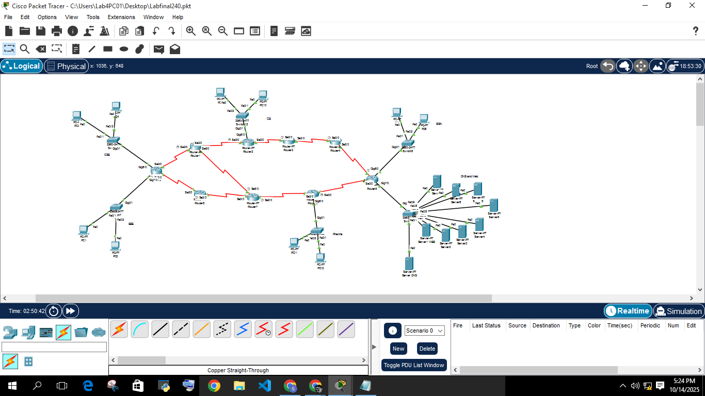
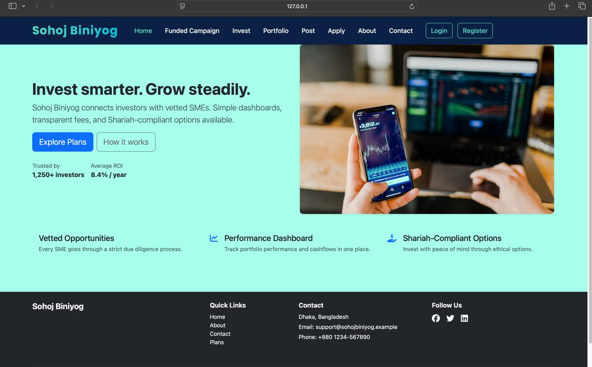
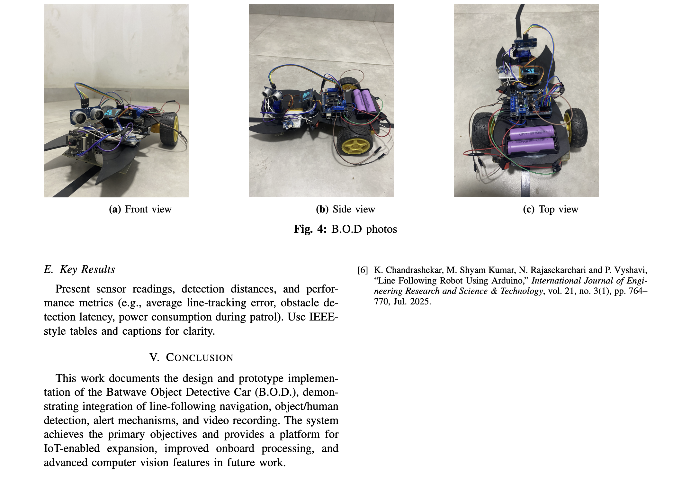
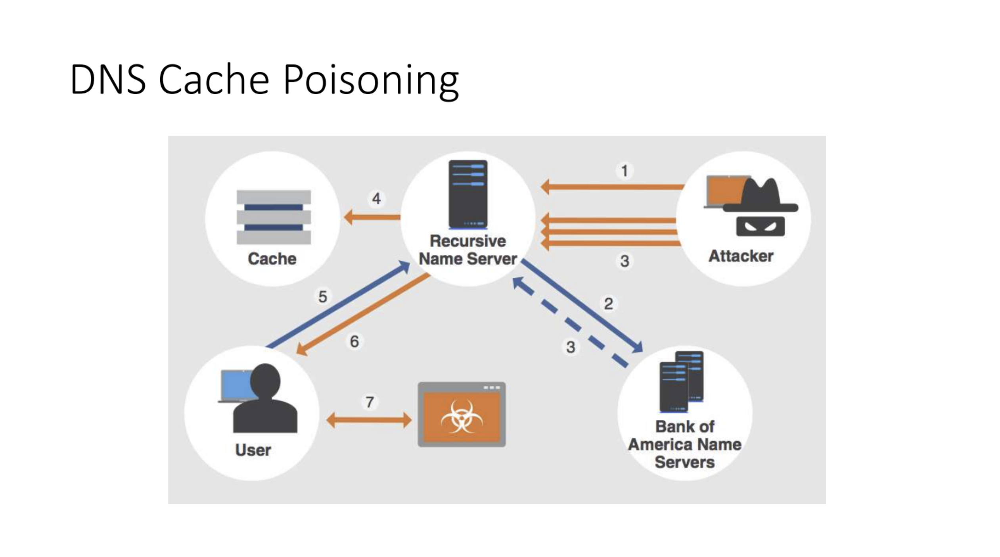
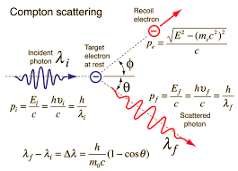
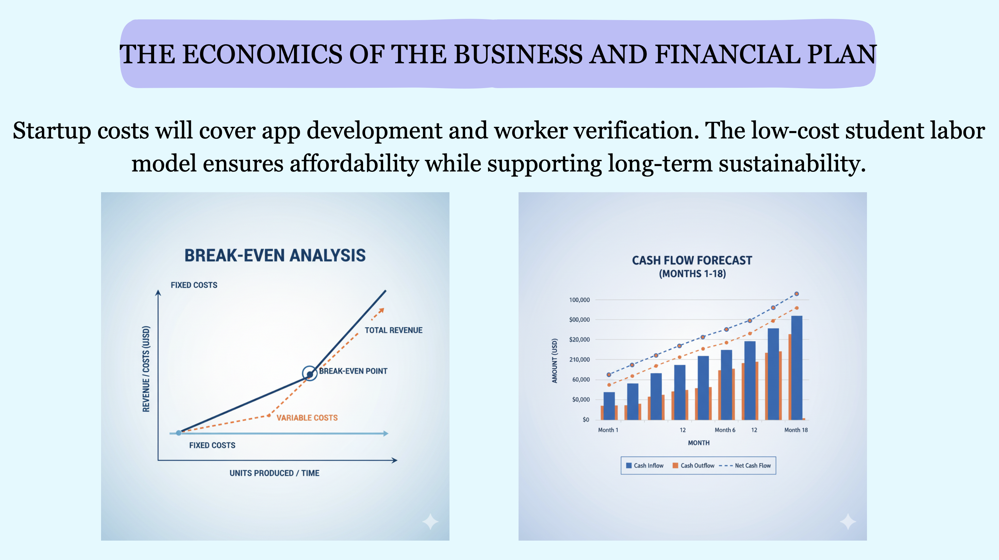

# 📘 UAP-3.2

All the **notes, projects, and final exam materials** for Semester 3.2 will be available here!

---

## 🧭 Course Index

| Subject | Description | Link |
|----------|--------------|------|
| 🌐 **Networking Final** | Covers all networking concepts, protocols, and lab solutions. | [View Notes](https://docs.google.com/document/d/19OwXbDJsfMMs73W8Yzd1MNLIAKSw0RMGhDLFAb7Aaq4/edit?tab=t.0) |
| 💻 **Software Final** | Includes software engineering concepts, design patterns, and case studies. | [View Notes](https://docs.google.com/document/d/1xjuVfMsgXUebxXS50PV7mf9TZFqHq0KEVizF_2zCy8k/edit?fbclid=IwY2xjawN0WF9leHRuA2FlbQIxMQABHuI6twnWoDCwOEJCZiNTWVHkKwg65JRnhOvwyOv02AO538w9b6iveSkKEnNp_aem_gcajGRDFUj2bCxZFyVGOFg&tab=t.ga49zmqltog9) |
| ⚙️ **Microprocessor Final** | All microprocessor theory, programs, and interfacing topics. | [View Notes](https://docs.google.com/document/d/1FNVyZFQ4AnBAmvGzM0JA3hYdELgSjNzJK0u6ERXyvM8/edit?tab=t.ilve90191sov) |
| 🛡️ **Cyber Security Final** | Notes on ethical hacking, network security, and cryptography. | [View Notes](https://docs.google.com/document/d/1p0-vLcKN8a_tsIK7yqMtIx6oeYsDSyWRcV_dhk2fxWg/edit?usp=drivesdk) |
| ⚡ **Physics Final** | Contains numerical solutions, derivations, and MCQ notes. | [View Notes](https://docs.google.com/document/d/12Q6Et8kVMUHSFCAFgVVTJmiynJPzduJAvb32a2k07EI/edit?tab=t.kjfdfls8am1h) |

---

## 🖼️ Photo Gallery

  
  

  
  

  
  

---

## 🧩 Repository Info

- **Semester:** UAP 3.2  
- **Purpose:** Centralized notes and materials for finals  
- **Use Uap gmail for access!  
- **Maintainer:** [H. M. Tahsin Sheikh]  

---

## 🚀 How to Use

1. Click on any **subject link** above to access notes.  
2. Download or view directly in GitHub.  
3. Contribute by adding your own materials via pull request.  

---

> 🎓 *“Organize your study, simplify your success.”*
